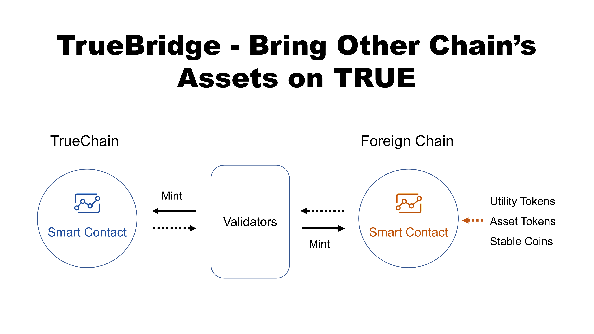

# Background

Cross-chain features are mostly needed when an asset is to be issued on multiple chains. It is not as much important to exchange in a barter-economy manner across different public chains. Rather, the need is to leverage communities and technical features on more than one public chain for better development of its own.

Our first practice working on a real cross-chain application was to bring DAI the stable coin to TrueChain when we worked with MakerDAO’s team. After that, we further worked with projects like PAX and some utility token projects and found generality in such cross-chain scenarios.

We decided to generalize the technology into a simple & effective framework. We call it The TrueBridge. By building TrueBridge, we will allow any asset on any chain to bring any portion of itself to TrueChain, and enjoy the global communities and the fast, reliable TrueChain infrastructure.

# The Real Need of Cross-Chain Transactions

There are two types of cross-chain technologies right now: the centralized oracles and the decentralized cross-chain processing networks. 

Instead of coming up with fancy papers, we want to deal with a basic need: bring any portion of assets from any foreign chains to TrueChain. The cross-chain infrastructure could support bridging any assets - Dapp coins, Stable Coins, and in future, asset tokens. With such an infrastructure, we can achieve the following goals:

- Allow assets to be issued and liquidated on multiple public chain infrastructures without oversupply, verifiably and transparently.
- Access to communities of TrueChain without losing the original token holders.

# Bring Assets and Liquidity to TrueChain

A TRUE bridge consists three components - TrueChain smart contract, foreign chain smart contract, and a set of validators. Tokens of any kind -- utility tokens, security tokens and stable coins -- can be locked up into a smart contract on any foreign chain and the same amount of tokens can be minted on TrueChain. 

Because of asynchronization between TrueChain and any foreign chains, a set of validators are required to perform validation when “mint” happens. There is a fixed set of validators. Every asset issuer is required to bring at least one external validators maintained by its own foundation or entity. During the “mint” process, validators from TrueBridge and the validator(s) from the issuer will co-perform multi-sig. Asset can only be minted after multi-sig is completed.

# A Case Study - TRUE-DAI Bridge

The [TrueChain-DAI Bridge](https://github.com/truechain/TRUE-Dai-Bridge) has already working, source code can be accessed. A live console is working, will be updated soon.